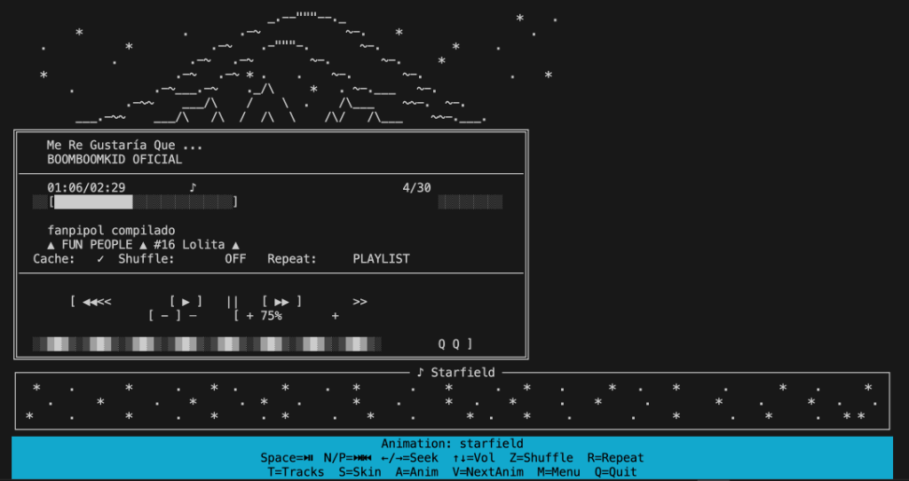

```
  ________  ________  ________  _______   ________  ________   ________  ________ 
 ╱    ╱   ╲╱        ╲╱       ╱ ╱       ╲╲╱    ╱   ╲╱        ╲ ╱        ╲╱        ╲
╱         ╱        _╱        ╲╱        ╱╱         ╱        _╱_╱       ╱╱         ╱
╲__     ╱╱╱       ╱╱         ╱         ╱         ╱-        ╱╱         ╱       --╱ 
  ╲____╱╱ ╲______╱ ╲________╱╲__╱__╱__╱╲________╱╲________╱ ╲________╱╲________╱  
```

# YTBMusic

**Terminal YouTube Music Player** con playlists, skins ASCII, descarga automática y buffering inteligente.

[](https://www.python.org/downloads/) [](https://opensource.org/licenses/MIT) [](https://github.com/vlasvlasvlas/ytbmusic/actions/workflows/ci.yml)



---

## ✨ Features

| Feature | Descripción |
|---------|-------------|
| 🎵 **Streaming + Cache** | Reproducción inmediata. El sistema descarga en segundo plano mientras escuchas. |
| 🔈 **Background Playback** | La música sigue sonando al volver al menú (`M`) o importar playlists. |
| ⬇️ **Smart Download (DownloadManager)** | Una sola cola + worker con **prioridades** (Import/Play/Auto), **dedupe**, cancelación y progreso throttled (UI fluida). |
| 📥 **Smart Import** | Importá **Playlists** o **Videos Individuales** (`I`) con pre-carga automática de títulos. |
| 💿 **Chapter Splitting** | ¡Nuevo! Convierte **videos largos** (álbums) en playlists de tracks individuales detectando los **timestamps** de la descripción. |
| 🎬 **Single Video Support** | Pegá cualquier link de YouTube (`watch?v=...`) y creará una playlist instantánea. |
| 🛡️ **Auto-Skip** | Detecta videos eliminados/privados y los marca como `unplayable` para siempre. |
| 🎼 **Track Picker** | En el reproductor, abrí la lista de temas con `T` y elegí qué reproducir (sin spamear Next). |
| 🎨 **Skins ASCII** | 9+ skins retro intercambiables. [Ver guía de Skins](SKINS.md). |
| 🔀 **Shuffle/Repeat** | Modos de reproducción aleatoria y repetición (Playlist/Track). |
| 📜 **Activity Log** | Panel de actividad scrolleable en el footer para ver imports y descargas. |
| 🌊 **Animaciones** | Visualizaciones ASCII dinámicas en el footer. [Ver guía de Animaciones](ANIMATIONS.md). |
| 💾 **Persistencia Segura** | Operaciones atómicas sobre playlists (write temp → rename) + lock para evitar JSON corrupto. |
| 🔐 **Auto-Auth con Cookies** | Si YouTube pide verificación, el sistema detiene la cola, te guía para abrir tu navegador y actualiza las cookies automáticamente con `yt-dlp`. |

---

## 🚀 Instalación y Uso

Este proyecto incluye scripts automatizados (`.sh` y `.bat`) para facilitar la instalación y configuración del entorno (venv, dependencias, librerías VLC).

### macOS / Linux (Recomendado)

1. **Clonar el repositorio:**
   ```bash
   git clone https://github.com/vlasvlasvlas/ytbmusic.git
   cd ytbmusic
   ```

2. **Instalar dependencias (`install.sh`):**
   Este script creará el entorno virtual (`venv`), activará python, e instalará `yt-dlp` y verificará VLC (optimizando para Apple Silicon si es necesario).
   ```bash
   ./install.sh
   ```

3. **Ejecutar (`run.sh`):**
   Este script activa el entorno virtual y configura las variables de entorno necesarias (LIBVLC) antes de lanzar la app.
   ```bash
   ./run.sh
   ```

### Windows

1. **Instalar dependencias:**
   Ejecuta el script batch para configurar el entorno.
   ```cmd
   install.bat
   ```

2. **Ejecutar:**
   ```cmd
   run.bat
   ```

**Requisitos Manuales:**
- Python 3.8+
- VLC Media Player (debe coincidir con la arquitectura de tu Python, ej: 64-bit)
- FFmpeg (opcional, para post-procesado de audio en casos raros)

## 🛡️ Anti-Bot / Cookies (YouTube)

YouTube endureció el rate-limit y muchas veces exige sesión iniciada incluso para reproducir playlists públicas.
`ytbmusic` ahora intenta autenticarse automáticamente de la siguiente manera:

1. Usa `cookies.txt` (ubicado en la raíz del repo) si existe.
2. Si no hay archivo, intenta leer cookies del navegador configurado.
   - Por defecto recorre `chrome`, `brave`, `edge`, `vivaldi`, `opera`, `chromium`, `firefox`, `safari`.
   - Podés forzar uno con `YTBMUSIC_COOKIES_BROWSER=firefox ./run.sh`.

Variables de entorno útiles:

| Variable | Descripción |
|----------|-------------|
| `YTBMUSIC_COOKIES_FILE` | Ruta absoluta a un `cookies.txt` exportado desde tu navegador. |
| `YTBMUSIC_COOKIES_BROWSER` | Nombre del navegador soportado por yt-dlp (`chrome`, `firefox`, etc.). |
| `YTBMUSIC_DISABLE_COOKIES` | Define cualquier valor para desactivar el auto-config (solo si sabés lo que hacés). |

Si YouTube bloquea una descarga con “Sign in to confirm you’re not a bot”, la app cancelará la cola, mostrará instrucciones sobre qué navegador abrir y, al confirmar, ejecutará automáticamente `yt-dlp --cookies-from-browser …` para generar `cookies.txt`. Sólo tenés que abrir el browser indicado, asegurarte de que YouTube esté abierto/logueado y presionar “Yes” cuando vuelvas a YTBMusic. Al terminar, el auto-download global se reanuda solo y continúa bajando todo lo pendiente.

Para generar `cookies.txt` seguí la guía oficial de yt-dlp: <https://github.com/yt-dlp/yt-dlp/wiki/FAQ#how-do-i-pass-cookies-to-yt-dlp>.
Sin cookies, YouTube puede responder “Sign in to confirm you’re not a bot” y las descargas fallarán.

---

## ⌨️ Controles

### Menú Principal
| Tecla | Acción |
|:-----:|--------|
| `1-9` | Seleccionar playlist |
| `P` | Reproducir playlist (Smart Resume si es la actual) |
| `space` | Reproducir/Pausar |
| `X` | Borrar playlist seleccionada |
| `I` | Importar nueva playlist (URL de YouTube) |
| `E` | Renombrar Playlist seleccionada |
| `R` | Random All Songs (Shuffle global) |
| `D` | Descargar pendientes de la playlist seleccionada |
| `A` | Mostrar/Ocultar animación en el footer |
| `B-L` | Cambiar skin rápido |
| `Q` | Salir |

### Reproductor
| Tecla | Acción |
|:-----:|--------|
| `Space` | Play/Pause |
| `N` / `P` | Next / Previous Track |
| `T` | Abrir lista de temas (Track Picker, `/` para buscar) |
| `D` | Descargar todos los tracks faltantes de la playlist actual |
| `←` / `→` | Seek ±10s |
| `↑` / `↓` | Volumen |
| `S` | Cambiar Skin (rotativo) |
| `A` | Activar/Desactivar Animación |
| `V` | Cambiar Animación (rotativo) |
| `Z` | Shuffle (On/Off) |
| `R` | Repeat (Playlist/Track/Off) |
| `M` | Volver al Menú Principal (Mantiene música) |
| `Q` | Salir |

---

## 📁 Estructura del Proyecto

```
ytbmusic/
├── core/          # Player/Downloader/Playlist/DownloadManager
├── playlists/     # Archivos .json con la metadata de tus listas
├── skins/         # Archivos de texto para los diseños ASCII
├── animations/    # Archivos de texto para visualizaciones ASCII
├── cache/         # Archivos de audio descargados (.m4a/webm)
├── logs/          # Logs rotativos de la aplicación (ytbmusic.log)
├── dist/          # Binarios compilados (si ejecutas build.py)
├── install.sh     # Script instalación *nix
└── run.sh         # Script ejecución *nix
```

**Nota sobre borrar playlists:** borrar una playlist elimina `playlists/<name>.json` pero **no** borra los audios ya descargados en `cache/`.
La app puede ofrecer borrar cache “no usado” al momento de borrar una playlist.

---

## 🏗️ Compilación (Binarios)

Podes generar un ejecutable standalone (sin depender de tener Python instalado en la máquina destino).

### Local
Ejecuta el script de construcción. Generará un `.zip` en la carpeta `dist/`.
```bash
python3 build.py
```

### GitHub Actions
El proyecto está configurado para compilar automáticamente en la nube para **Windows**, **macOS** y **Linux** cada vez que se crea un tag (ej: `v1.0.0`). Revisá la pestaña "Releases" en GitHub.

---

## 🎨 Personalización
 
YTBMusic es altamente personalizable. Podes crear tus propios diseños:
 
- **[Guía de Skins](SKINS.md):** Aprende a diseñar interfaces completas (carátulas).
- **[Guía de Animaciones](ANIMATIONS.md):** Crea visualizaciones (ondas, ecualizadores) para el footer.
 
---
 
## 📄 Licencia

MIT License. Sentite libre de usarlo y modificarlo.
