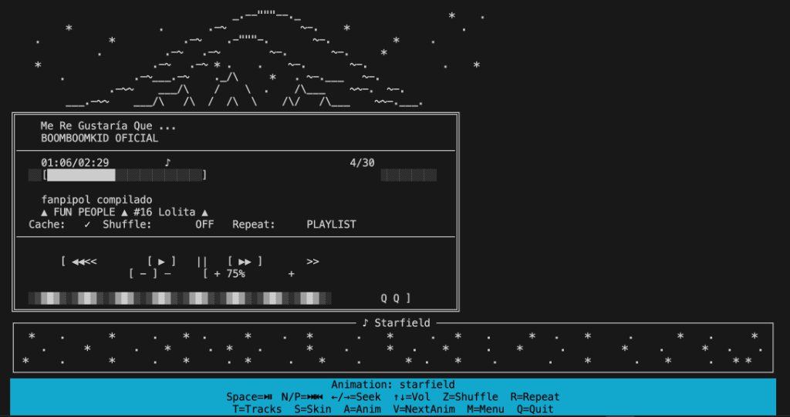

```
  ________  ________  ________  _______   ________  ________   ________  ________ 
 ╱    ╱   ╲╱        ╲╱       ╱ ╱       ╲╲╱    ╱   ╲╱        ╲ ╱        ╲╱        ╲
╱         ╱        _╱        ╲╱        ╱╱         ╱        _╱_╱       ╱╱         ╱
╲__     ╱╱╱       ╱╱         ╱         ╱         ╱-        ╱╱         ╱       --╱ 
  ╲____╱╱ ╲______╱ ╲________╱╲__╱__╱__╱╲________╱╲________╱ ╲________╱╲________╱  
```

# YTBMusic

**Terminal YouTube Music Player** con playlists, skins ASCII, descarga automática, streaming externo y buffering inteligente.

[](https://www.python.org/downloads/) [](https://opensource.org/licenses/MIT) [](https://github.com/vlasvlasvlas/ytbmusic/actions/workflows/ci.yml)



---

## ✨ Features

| Feature | Descripción |
|---------|-------------|
| 🌐 **Multilenguaje** | Interfaz en Español e Inglés. Cambiá desde Settings o con `YTBMUSIC_LANG=en`. |
| 🎧 **Streaming Externo** | Transmití a servidores Icecast/Shoutcast. Compartí el link con amigos. |
| 🌈 **Gradientes Demoscene** | 12 patrones animados (aurora, starfield, kaleidoscope, fireflies...). |
| 💿 **Chapter Splitting** | Videos con timestamps se convierten en playlists con tracks individuales. |
| 🎵 **Streaming + Cache** | Reproducción inmediata + descarga en segundo plano. |
| 🔈 **Background Playback** | La música sigue al volver al menú (`M`) o importar playlists. |
| ⬇️ **Smart Download** | Cola inteligente con prioridades, dedupe y progreso. |
| 📥 **Smart Import** | Importá Playlists o Videos (`I`) con detección de chapters. |
| 🎬 **Single Video** | Pegá `watch?v=...` y crea una playlist instantánea. |
| 🛡️ **Auto-Skip** | Detecta videos eliminados/privados automáticamente. |
| 🎼 **Track Picker** | Abrí lista de temas (`T`) y elegí qué reproducir. |
| 🔍 **Búsqueda Global** | Busca en todas las playlists (`F`). |
| 🖼️ **Fondos** | Sólidos, transiciones o gradientes. [Ver guía](BACKGROUNDS.md). |
| 🎨 **Skins ASCII** | 10+ skins retro. [Ver guía](SKINS.md). |
| 🌊 **Animaciones** | Visualizaciones dinámicas. [Ver guía](ANIMATIONS.md). |
| 🔀 **Shuffle/Repeat** | Modos de reproducción aleatoria y repetición. |
| 🛠️ **Settings** | Diagnóstico, streaming, cache, idioma. |
| 🔐 **Auto-Auth** | Auto-refresco de cookies si YouTube pide verificación. |

---

## 🚀 Quick Start

```bash
# Clonar
git clone https://github.com/vlasvlasvlas/ytbmusic.git
cd ytbmusic

# Instalar (crea venv + dependencias)
./install.sh

# Ejecutar
./run.sh

# Ejecutar en inglés
YTBMUSIC_LANG=en ./run.sh
```

**Windows:** Usá `install.bat` y `run.bat`.

**Requisitos:**
- Python 3.8+
- VLC Media Player
- FFmpeg (opcional, para streaming externo)

---

## 🌐 Idioma

YTBMusic soporta **Español** (default) e **Inglés**.

```bash
# Desde terminal
YTBMUSIC_LANG=en ./run.sh

# O desde la app
Settings (O) → 🌐 Idioma / Language (Click to toggle)
```

---

## ⌨️ Controles

### Menú Principal

Usá **selectores visuales** para playlists, skins y fondos. Navegá con flechas + Enter.

| Tecla | Acción |
|:-----:|--------|
| `I` | Importar playlist/video |
| `F` | Buscar en todas las playlists |
| `R` | Random All Songs |
| `O` | Settings / Herramientas |
| `P` | Reproducir playlist |
| `E` | Renombrar playlist |
| `D` | Descargar tracks pendientes |
| `X` | Borrar playlist |
| `A` | Toggle animación |
| `Q` | Salir |

### Reproductor

| Tecla | Acción |
|:-----:|--------|
| `Space` | Play/Pause |
| `N` / `P` | Next / Previous Track |
| `T` | Track Picker |
| `←` / `→` | Seek ±10s |
| `↑` / `↓` | Volumen |
| `S` | Cambiar Skin |
| `B` | Cambiar Fondo |
| `A` | Toggle Animación |
| `V` | Cambiar Animación |
| `Z` | Shuffle On/Off |
| `R` | Repeat (Playlist/Track/Off) |
| `M` | Volver al Menú |
| `Q` | Salir |

---

## ⚙️ Settings

Abrí con `O` desde el menú:

| Opción | Descripción |
|--------|-------------|
| **Diagnóstico** | Estado de VLC, cookies, yt-dlp |
| **Streaming** | Configurar Icecast para compartir música |
| **Limpiar Cache** | Borrar archivos huérfanos |
| **Refrescar Cookies** | Actualizar desde navegador |
| **🌐 Idioma** | Alternar Español / English |

---

## 🎧 Streaming Externo (Icecast)

Transmití tu música para que amigos escuchen en tiempo real.

### Requisitos
1. **Servidor Icecast** corriendo (local o remoto)
2. **FFmpeg** instalado (`brew install ffmpeg` / `apt install ffmpeg`)
3. Track descargado en cache (no streaming directo de YouTube)

### Configuración
1. Abrí Settings (`O`) → **Editar Streaming**
2. Configurá:
   - **URL**: `http://tu-servidor:8000/stream`
   - **Usuario**: `source` (default Icecast)
   - **Password**: tu password de Icecast
   - **Bitrate**: 128 kbps (recomendado)
3. Clic en **▶️ INICIAR STREAM**

### Compartir
Una vez activo, aparece el **link para compartir**:
```
http://tu-servidor:8000/stream
```
Otros pueden abrirlo en VLC, navegador, o cualquier reproductor.

---

## 💿 Chapter Splitting

Al importar un video largo con timestamps en la descripción (ej: álbum completo), YTBMusic detecta los chapters automáticamente y crea un track por cada uno.

```
01. Track One - 00:00
02. Track Two - 03:45
03. Track Three - 07:20
```

Cada track salta a su posición correcta al reproducir. El audio se descarga una sola vez.

## 🛡️ Cookies (Anti-Bot)

YouTube puede pedir verificación. YTBMusic intenta autenticarse:

1. Usa `cookies.txt` (raíz del repo) si existe
2. Lee cookies del navegador configurado

```bash
# Forzar navegador específico
YTBMUSIC_COOKIES_BROWSER=firefox ./run.sh
```

| Variable | Descripción |
|----------|-------------|
| `YTBMUSIC_COOKIES_FILE` | Ruta a `cookies.txt` |
| `YTBMUSIC_COOKIES_BROWSER` | `chrome`, `firefox`, etc. |
| `YTBMUSIC_LANG` | `es` o `en` |

---

## 📁 Estructura

```
ytbmusic/
├── core/          # Player, Downloader, Playlist, Streaming
├── ui/            # Interfaz (views, loaders)
├── config/        # Configuración + i18n
├── playlists/     # Archivos .json
├── skins/         # Diseños ASCII
├── animations/    # Visualizaciones
├── backgrounds/   # Fondos JSON
├── cache/         # Audio descargado
├── logs/          # Logs rotativos
└── run.sh         # Script de ejecución
```

---

## 🎨 Personalización

- **[Skins](SKINS.md)** - Interfaces ASCII completas
- **[Animaciones](ANIMATIONS.md)** - Visualizaciones para el footer (3 líneas)
- **[Fondos](BACKGROUNDS.md)** - 12 patrones animados (aurora, kaleidoscope, fireflies, tunnel, etc). Soporta comentarios `//` en JSON.

---

## 🏗️ Compilación

```bash
python3 build.py  # Genera ejecutable standalone
```

GitHub Actions compila para Windows, macOS y Linux en cada release.

---

## 🔧 Troubleshooting

### Error 403 al descargar playlists

YouTube bloquea versiones viejas de `yt-dlp`. Si ves `HTTP Error 403: Forbidden` en los logs:

```bash
# Actualizar yt-dlp dentro del venv
venv/bin/pip install --upgrade yt-dlp

# O si instalaste globalmente
pip install --upgrade yt-dlp
```

Si el error persiste, refresheá las cookies desde Settings (`O`) → **Refrescar Cookies**.

---

## 📋 Changelog

### 2026-09-17
- **Fix:** Método `_update_now_playing_footer` faltante que causaba crash al iniciar reproducción
- **Fix:** Actualizado requisito mínimo de `yt-dlp` a `>=2026.08.01` para resolver errores 403 de YouTube

---

## 📄 Licencia

MIT License. Usalo y modificalo libremente.
## License

MIT License — © 2026 [Vladimiro Bellini](https://github.com/vlasvlasvlas). Free to use and modify, attribution required.
